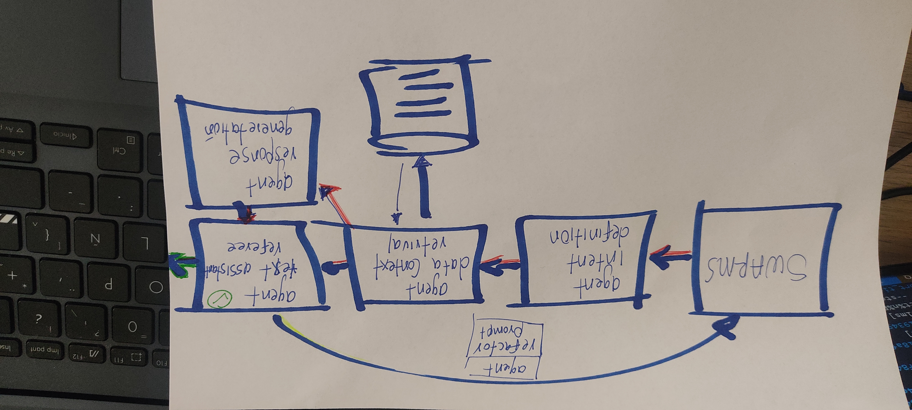

# README

## Descripción

`run_swarms` es una función que ejecuta un proceso iterativo para generar y validar respuestas basadas en la intención del usuario. Este proceso se repite hasta que se obtiene una respuesta válida o se alcanza un número máximo de iteraciones.

## Diagrama idea principal



## Arquitectura del Sistema

1. **Definición de la Intención del Agente**:

   - La función `agent_intent_definition` analiza el mensaje del usuario para determinar la intención del agente.

2. **Recuperación de Datos de Contexto**:

   - La función `agent_context_data_retrieval` obtiene los datos de contexto necesarios basados en la intención definida.

3. **Generación de Respuesta**:

   - La función `agent_response_generation` genera una respuesta utilizando el mensaje del usuario, los datos de contexto y la intención.

4. **Validación de la Respuesta**:

   - La función `agent_text_assistant_referee` valida la respuesta generada comparándola con la respuesta esperada.

5. **Refactorización del Mensaje del Usuario**:
   - Si la respuesta no es válida, la función `agent_refactor_promp` modifica el mensaje del usuario y el proceso se repite.

## Video

<video width="600" controls>
  <source src="LLMHackathon.mp4" type="video/mp4">
  Tu navegador no soporta la etiqueta de video.
</video>

## Instalación

```python
pip install -r requirements.txt
```
